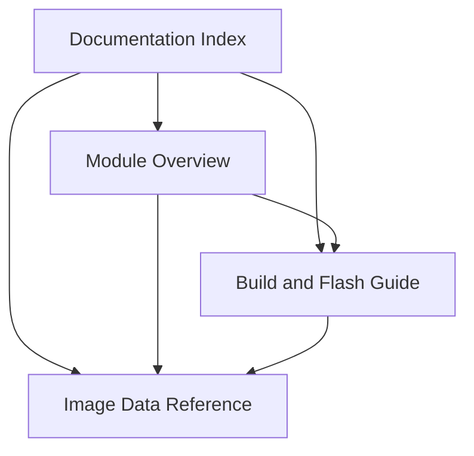

# Documentation Index

This page is the entry point for repository documentation.

## Reading Guide

| If you want to understand... | Start here |
| --- | --- |
| the current firmware structure | [module-overview.md](module-overview.md) |
| how to set up and build the firmware | [user-guides/build-and-flash.md](user-guides/build-and-flash.md) |
| how image resources are stored and regenerated | [reference/image-data.md](reference/image-data.md) |

## Document Map

## Suggested Reading Order

1. Read [module-overview.md](module-overview.md) for the implemented source layout.
2. Read [user-guides/build-and-flash.md](user-guides/build-and-flash.md) for dependency setup and build commands.
3. Read [reference/image-data.md](reference/image-data.md) before replacing bundled image resources.
